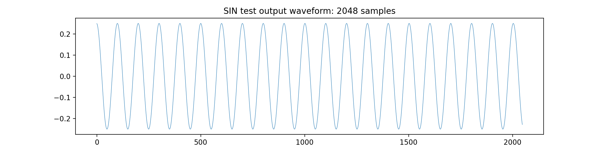
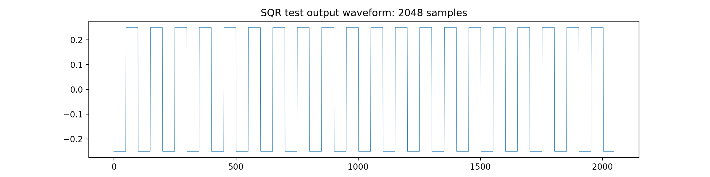
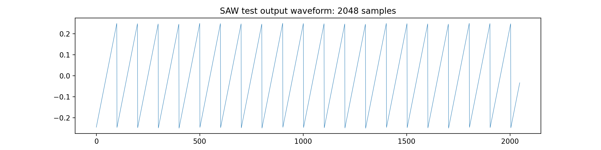
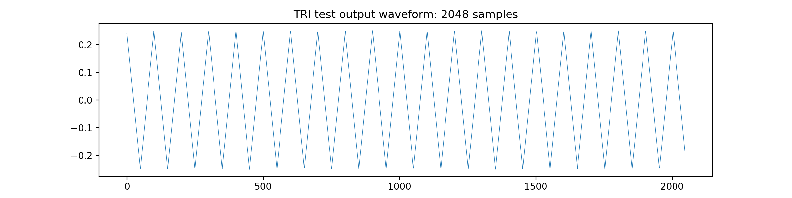
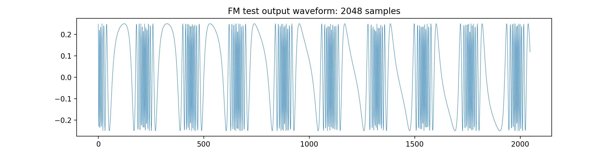
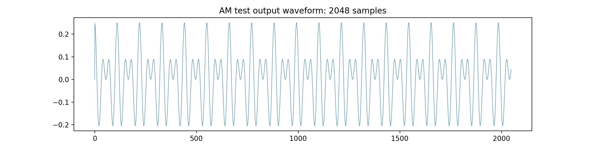
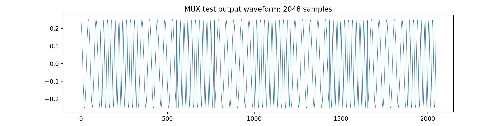

# egress

### Willis Hoke

## Intro

`egress` is a an object-oriented C++ library for building realtime emulations of analog synthesizers. It is built to be lean, efficient, and portable, although it is currently only tested on MacOS. No external libraries are required. Sample rates down to 64 samples / second have been tested. Sample implementations are provided for voltage controlled oscillators (`VCO`), four-quadrant multipliers (`VCA`), and two-way analog multiplexers (`MUX`). A full suite of tests demonstrates functionality of each of the modules, showing waveform outputs for each of the VCO outputs and demonstrating basic exponential FM and linear AM.

This project owes a giant technical debt to Andrew Belt's `VCVRack` project. Although the architecture is different, it served as an inspiration throughout the development process.

## Build

To build, clone the repository and run `make all`. This will yield a binary file, `egress`, that will continually generate output in real time until interrupted by the user with any keyboard input. 

This build has been tested only on MacOS 11.2 using the `llvm`m compiler. Tests can be built using `make debug`. This will yield a program that prints values to `stdout` for a single buffer length before exiting.

## Rack

`Rack` is responsible for storing modules and managing connections between them. It also manages mixing and stores the output buffer. Racks store modules using an associative map with a unique name as key and `unique_ptr` to a module object as value. This allows for efficient lookup and constant-time iteration through the module list. Connections are stored using an associative map, with an output module's name and output ID as keys and module name and input ID as values. `Rack` has a `process` method that will iterate through the computation graph, sending output values from one module to another. It then calls each module's `process` method and stores this value in the output buffer. Since the buffer updates occur sequentially, the connection latency between any two modules is only a single sample. 

## Modules

`Module` is a base class that manages inputs, outputs, and postprocessing. Each time a module has finished processing, it should invoke the base class `postprocess` method to reset to default input values. All outputs are clipped to the range [-10.0, 10.0]. It is assumed that most signals are bipolar and in range [-5.0, 5.0]. Each subclass of `Module` should declare an enumeration specifying its inputs and outputs.

### VCO
#### A voltage controlled saw-core FM oscillator

`VCO` is a standard oscillator, with outputs for `saw`, `tri`, `sin`, and `sqr` waves. The oscillator follows the typical 1V / octave standard, so a value of `1.0` present at the `FM` input will result in a tone exactly 1 octave above the fundamental. An optional `FM_INDEX` parameter allows dynamic scaling of FM values. The constructor for `VCO` takes a single value specifying the intial frequency. All tests were run with a wave at 440hz for 2048 samples.

Inputs: `FM`, `FM_INDEX`

Outputs: 

`SIN`

`SQR`

`SAW`

`TRI`

#### Frequency Modulation

FM was tested with a base freqency of 1000hz, a modulation frequency of 200hz, and an FM index of 3.

### VCA
#### Voltage controlled amplifier

`VCA` takes two inputs, `IN1` and `IN2`, and outputs `OUT`. The output voltage is downscaled by a factor of 5 to accomodate +/-5V control signals.

Amplitude modulation was tested with a base frequency of 1000hz and a modulation frequency of 200hz at 2048 samples.

### MUX
#### Voltage controlled analog multiplexer

`MUX` takes three inputs, `IN1`, `IN2`, and `CTRL`. The input presented at `OUT1` is chosen based on the polarity of the control signal.

`MUX` was tested by generating three waveforms, one at 1000hz, one at 2000hz, and a third at 100hz. The third waveform was used as the control input to switch between the two outputs.

### CONST
#### Constant value

`CONST` takes no inputs. It can be used to provide an offset value -- i.e., for changing an FM modulation index.

## Testing

Tests can be compiled with `make debug`. The `test` directory contains Python scripts for visualizing test outputs.

## Next Steps

Several methods are still incomplete, including those to remove modules or connections. More validation checks should be added to ensure module names are valid, etc. While the syntax for declaring modules is fairly terse, it doesn't seem right to have the caller be managing memory. This should probably be accomplished by factory functions in the Rack class. Better test automation would be nice -- should be able to write a script to run all tests sequentially.
 
It would be worthwhile to test alternative implementations for storing modules and their connections. Even just using vectors might end up being more efficient due to the linear memory layout. This libarary lacks any front end implementation, but it would be relatively straightforward to augment it with a simple parser to process user input for interactive use.

## License

Free use of `egress` is permitted under the terms of the MIT License.