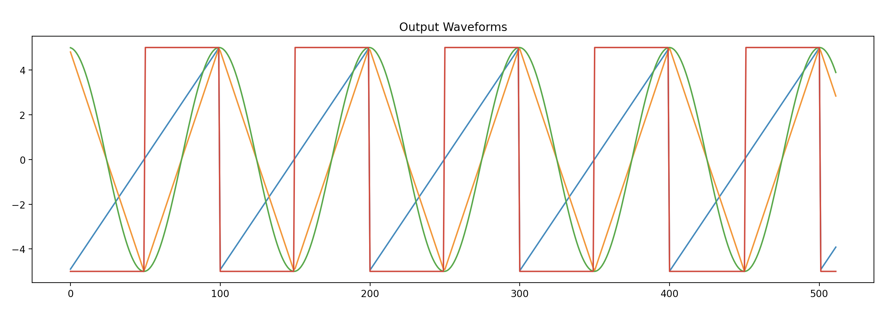

# egress

### Willis Hoke

### Modules

#### VCO
A voltage controlled oscillator

Parameter specifies initial frequency

Inputs: `am`, `fm`

Outputs: `sin`, `sqr`, and `tri`

#### MUL
4-quadrant multiplication

Optional argument specifies offset in range [-10.0, 10.0]

Unity gain with input value of 5.0
